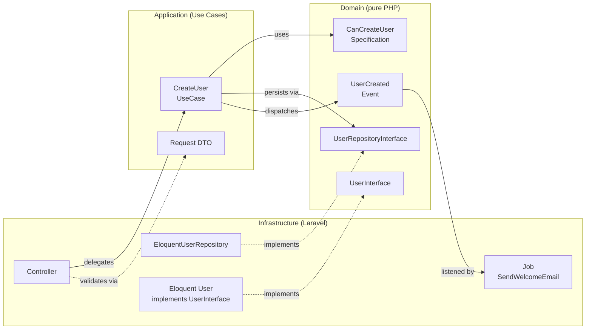
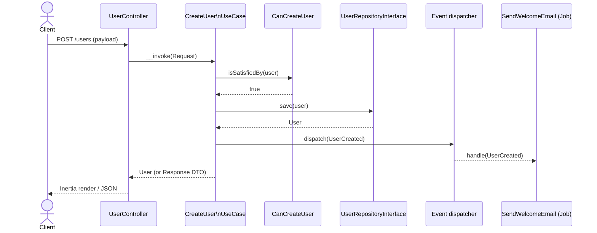

# Quote Plus

Conversion-assistance tool for craftsmen and service providers: automatically
qualifies incoming quote requests and generates contextualised follow-ups for
prospects who haven't replied.

Laravel 13 + React 19 (Inertia) demo project, architected in strict
DDD / Clean / Hexagonal layers.

## Stack

- **Backend** — Laravel 13, PHP ≥ 8.3, Pest 4, `spatie/laravel-data`,
  Inertia.js, Wayfinder.
- **Frontend** — React 19 + TypeScript, Inertia React adapter, Tailwind v4,
  Vite 8 (with `babel-plugin-react-compiler`).
- **Database** — SQLite by default (`database/database.sqlite`), created
  automatically by `composer setup`.

## Quickstart

```bash
composer setup        # install deps, copy .env, generate key, migrate, build assets
composer dev          # parallel: php artisan serve + queue:listen + pail + vite
```

App served on `http://localhost:8000`.

## Common commands

### Tests (Pest)

```bash
./vendor/bin/pest                                       # full suite
./vendor/bin/pest tests/Unit/ArchTest.php               # single file
./vendor/bin/pest --filter="creates a user"             # targeted test
composer test                                           # config:clear + pint --test + pest
```

- Feature tests use `RefreshDatabase` (see `tests/Pest.php`).
- `tests/Unit/ArchTest.php` is the **CI architectural guardrail** — any DDD
  layering violation fails there.

### Lint / format / types

```bash
composer lint           # Pint (PHP) — formats in place
composer lint:check     # Pint --test (CI mode)
npm run lint            # ESLint --fix
npm run lint:check      # ESLint without fix
npm run format          # Prettier --write resources/
npm run format:check    # Prettier --check (CI)
npm run types:check     # tsc --noEmit
composer ci:check       # full bundle: lint:check + format:check + types:check + test
```

### Build

```bash
npm run build           # frontend production build
npm run build:ssr       # build + SSR
```

## Architecture (DDD / Clean / Hexagonal)

`docs/architecture.md` (in French) is the **source of truth** — read it before
any structural change.

The `app/` folder contains **only** `Domain/`, `Application/`,
`Infrastructure/`. Default Laravel layout (`app/Http/`, `app/Providers/`,
`app/Models/`) has been removed; its content is redistributed inside
`Infrastructure/`.

### Layer flow & dependency inversion



Solid arrows = runtime call; dotted arrows = `implements`. Domain depends on
nothing; Infrastructure depends on Domain interfaces (inversion of control
wired in `Infrastructure/Providers/DomainServiceProvider.php`).

### Sequence — `CreateUser` use case



### Annotated `app/` tree

```text
app/
├── Domain/                      # pure PHP, zero framework
│   ├── Entity/                  # interfaces only — *Interface suffix
│   ├── Event/<Aggregate>/       # final readonly, past tense (UserCreated)
│   ├── Exception/               # business exceptions
│   ├── Factory/                 # interfaces only
│   ├── Model/                   # value objects, enums
│   ├── Repository/              # interfaces only — *RepositoryInterface
│   ├── Service/                 # interfaces only (e.g. MailerInterface)
│   └── Specification/           # business rules — Can… prefix
│
├── Application/
│   └── UseCase/<UseCaseName>/
│       ├── UseCase.php          # final, orchestration only
│       ├── Request.php          # extends AbstractRequest (spatie/laravel-data)
│       └── Response.php         # optional, extends AbstractResponse
│
└── Infrastructure/              # the only layer allowed to know Laravel
    ├── Entity/                  # Eloquent models — implements *Interface
    ├── Event/                   # framework adapters around Domain events
    ├── Factory/                 # Eloquent factory implementations
    ├── Http/
    │   ├── Controller/          # thin, delegates to a Use Case
    │   └── Middleware/
    ├── Job/                     # async handlers (Symfony MessageHandler equiv.)
    ├── Providers/
    │   └── DomainServiceProvider.php   # all interface→impl + event→job wiring
    ├── Repository/              # Eloquent impls — Eloquent… prefix
    └── Service/                 # framework/lib implementations of Domain services
```

### `app/Domain/` — pure PHP, zero framework

- `Entity/`, `Repository/`, `Factory/` — **interfaces only** (enforced by
  ArchTest).
- `Specification/` — business rules (`CanXxx`), extending
  `AbstractSpecification`.
- `Event/<Aggregate>/` — `final readonly` events, past tense (e.g.
  `UserCreated`).
- `Model/`, `Exception/` — value objects, enums, business exceptions.
- `Service/` — interfaces only (e.g. `MailerInterface`), no implementation.
- ArchTest allow-list: `App\Domain`, `Ramsey\Uuid`, `DateTimeImmutable`,
  `RuntimeException`. Any other import requires updating the rule explicitly.

### `app/Application/UseCase/<UseCaseName>/`

- `UseCase.php` (`final`, orchestration only).
- `Request.php` (`extends AbstractRequest`, attribute-based validation via
  `spatie/laravel-data`).
- `Response.php` (`extends AbstractResponse`) — **only when needed**; otherwise
  the Use Case returns a Domain entity directly.
- ArchTest allow-list: `App\Application`, `App\Domain`, `Ramsey\Uuid`,
  `Spatie\LaravelData`.
- **Forbidden**: Eloquent, `FormRequest`, `Illuminate\Http\Request`, direct DB
  access.

### `app/Infrastructure/`

- `Entity/` — Eloquent models that **implement** Domain interfaces
  (`User implements UserInterface`).
- `Repository/` — Eloquent implementations, prefixed `Eloquent…`.
- `Http/Controller/` — thin controllers delegating to a Use Case.
- `Job/` — async handlers (equivalent of Symfony `MessageHandler`).
- `Providers/DomainServiceProvider.php` — **all** interface → implementation
  bindings, plus Domain Event → Job wiring
  (`$events->listen(UserCreated::class, …)`). Registered from
  `bootstrap/providers.php`.

### "Service" — three families

- Interface (business need) → `Domain/Service/`.
- Framework/lib implementation → `Infrastructure/Service/`.
- Pure-PHP orchestrator shared across Use Cases → `Application/Service/`
  (create the folder only when there is content).

### Naming

| Type                    | Convention             |
| ----------------------- | ---------------------- |
| Domain interface        | `Interface` suffix     |
| Repository impl.        | `Eloquent` prefix      |
| Specification           | `Can…` prefix          |
| Use Case class          | `UseCase`              |
| Request / Response DTO  | `Request` / `Response` |
| Domain Event            | past tense, `final readonly` |
| Job                     | imperative             |
| Controller              | `Controller` suffix    |

## ArchTest rules (failing CI otherwise)

Allow-list approach — any import not listed makes CI fail.

- `App\Domain` can only use its own allow-list (see above).
- `App\Application` likewise.
- Every `*\Request` under `App\Application\UseCase` must `extends AbstractRequest`.
- Use Case classes: `final`. Domain Events: `final readonly`.
- `Illuminate\Database\Eloquent\Model` is forbidden inside `Domain` and
  `Application`.

To add a new dependency in Domain or Application, **explicitly update**
`tests/Unit/ArchTest.php` and reflect the change in `docs/architecture.md`.

## Frontend (Inertia + Wayfinder)

- Entry — `resources/js/app.tsx`, pages under `resources/js/pages/`.
- **Wayfinder** (`@laravel/vite-plugin-wayfinder`) generates TS helpers from
  Laravel routes into `resources/js/routes/`, `resources/js/actions/`,
  `resources/js/wayfinder/`. Regenerated by Vite — **do not edit by hand**.
- Fonts via `bunny('Instrument Sans')` (laravel-vite-plugin fonts plugin).

## Conventions

- Code identifiers, commits, PR titles/descriptions, and tooling files are in
  English.
- `docs/architecture.md` is intentionally in French — keep it that way.
- See `CLAUDE.md` for the full contributor playbook.

## Further reading

- [`docs/architecture.md`](docs/architecture.md) — full DDD/Clean architecture
  rationale (FR).
- [`CLAUDE.md`](CLAUDE.md) — contributor and tooling reference (EN).
