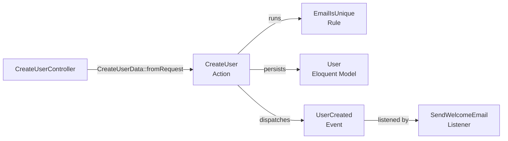
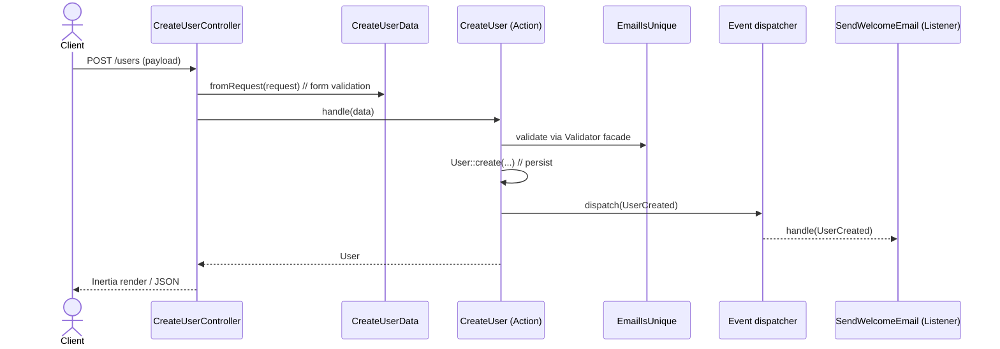

# Quote Plus

Conversion-assistance tool for craftsmen and service providers: automatically
qualifies incoming quote requests and generates contextualised follow-ups for
prospects who haven't replied.

Laravel 13 + React 19 (Inertia) demo project, built on an idiomatic
**layered Laravel** architecture (Actions + Active Record).

## Stack

- **Backend** — Laravel 13, PHP ≥ 8.3, Pest 4, `spatie/laravel-data`,
  Inertia.js, Wayfinder.
- **Frontend** — React 19 + TypeScript, Inertia React adapter, Tailwind v4,
  Vite 8 (with `babel-plugin-react-compiler`).
- **Database** — SQLite by default (`database/database.sqlite`), created
  automatically by `composer setup`.
- **Qualification** — local LLM via [Ollama](https://ollama.com) (`llama3.2:3b`
  by default), behind a `Qualifier` contract (`App\Contracts`) with an Ollama
  adapter (`App\Services\OllamaQualifier`).

## Requirements

- **PHP ≥ 8.3** and **Composer**.
- **Node.js** (LTS) and **npm**.
- **[Ollama](https://ollama.com)** for the qualification engine — it powers both
  the synchronous submission gate (is the description detailed enough to quote?)
  and the asynchronous labelling (relevance, project type, summary, € estimate).
  Install it (<https://ollama.com/download>) and pull the model used by default:

  ```bash
  ollama pull llama3.2:3b
  ```

  Ollama listens on `http://localhost:11434` out of the box; override in `.env`
  via `OLLAMA_BASE_URL` / `OLLAMA_MODEL` if needed. The async qualification runs
  on the queue, so keep a worker running (`composer dev` already starts
  `queue:listen`).

  > **Optional for basic dev.** The qualifier *fails open*: if Ollama is
  > unreachable, contact submissions still go through and the request stays
  > "not yet qualified" until a worker reaches the model.

## Quickstart

```bash
composer setup        # install deps, copy .env, generate key, migrate + seed, build assets
composer dev          # parallel: php artisan serve + queue:listen + pail + vite
```

App served on `http://localhost:8000`.

## Common commands

### Tests (Pest)

```bash
./vendor/bin/pest                                       # full suite
./vendor/bin/pest tests/Unit/ArchTest.php               # single file
./vendor/bin/pest --filter="creates a user"             # targeted test
composer test                                           # config:clear + pint --test + pest
```

- Three testsuites (`phpunit.xml`): `Unit` (no DB), `Feature` (Actions +
  Listeners, with `RefreshDatabase`), `Functional` (HTTP/Controllers, with
  `RefreshDatabase`). `RefreshDatabase` wiring lives in `tests/Pest.php`.
- Run a single suite with `./vendor/bin/pest --testsuite=Functional` (or
  `Feature`, `Unit`).
- `tests/Unit/ArchTest.php` and `tests/Unit/ArchDataConstructionTest.php` are
  the **CI architectural guardrails** — any layering violation fails there.

### Lint / format / types

```bash
composer lint           # Pint (PHP) — formats in place
composer lint:check     # Pint --test (CI mode)
npm run lint            # ESLint --fix
npm run lint:check      # ESLint without fix
npm run format          # Prettier --write resources/
npm run format:check    # Prettier --check (CI)
npm run types:check     # tsc --noEmit
composer ci:check       # full bundle: lint:check + format:check + types:check + test
```

### Build

```bash
npm run build           # frontend production build
npm run build:ssr       # build + SSR
```

### Database seeding

Demo data is provided through Laravel **factories** (`database/factories/`) and
**seeders** (`database/seeders/`).

```bash
php artisan db:seed                 # seed an existing database
php artisan migrate:fresh --seed    # drop + remigrate + reseed (dev reset)
```

`composer setup` already runs `migrate --force --seed`, so a fresh install comes
with demo data.

`DatabaseSeeder` seeds: the test user (`test@example.com`), the singleton
`ArtisanProfile` (mono-artisan app), and a batch of `ContactRequest` records.

> **No seeding in production.** `DatabaseSeeder` short-circuits when
> `app()->environment('production')` — production data never depends on
> fixtures. Reference data that must exist in production belongs in
> **migrations**, not seeders.

## Architecture (Layered Laravel — Actions + Active Record)

`docs/architecture.md` (in French) is the **source of truth** — read it before
any structural change.

```text
HTTP (Controller)  →  Action (orchestration + business rules)  →  Model (Active Record)
                            ├─ Data  (input DTO, form validation)
                            └─ Rules (reusable business rules)
```

**Golden rule**: HTTP stops at the Controller. The Action carries the business
(validation included) and never touches the HTTP layer. Eloquent is used
directly.

### Layer flow



### Sequence — `CreateUser` use case



### Layers (`app/`)

| Folder | Role |
| --- | --- |
| `Models/` | Eloquent entities. UUIDv7 identity via the native `HasUuids` trait on the `uuid` column (`id` stays the auto-increment PK). |
| `Actions/` | Use cases (`final readonly`, `handle(XxxData): Model`). Run business `Rules` via the `Validator` facade, persist, dispatch a native event. **Never use `Illuminate\Http`.** |
| `Data/` | Input DTOs (`extends Spatie\LaravelData\Data`, `readonly` props) carrying **form validation**. Built **only** via `fromRequest(Request)` / `fromValues(...)`, each calling `validateAndCreate`. Direct `new XxxData(...)` is forbidden (AST guardrail). |
| `Rules/` | Reusable business rules (`implements ValidationRule`), e.g. `EmailIsUnique`. |
| `Enums/` | `RequestType`, `Deadline`. |
| `Events/` | Native events (`use Dispatchable`), carry the model. |
| `Listeners/` | Wired explicitly in `EventServiceProvider` (`shouldDiscoverEvents(): false`). |
| `Mail/` | Mailables (`ShouldQueue`). |
| `Http/Controllers/` | Thin invokable controllers: `$action->handle(XxxData::fromRequest($request))`. |
| `Providers/` | `AppServiceProvider` (rate limiters, defaults), `EventServiceProvider` (event→listener map). |

### Validation model (the core decision)

The **Action is the single validation authority** — not the HTTP boundary — so
invalid data can never reach it whatever the caller (HTTP, queue, CLI, test).

- **Form** (`required`/`email`/`max`/enum) → in the **Data**, fired at
  construction (`fromRequest`/`fromValues`). Throws
  `Illuminate\Validation\ValidationException` → 422 / redirect-back.
- **Business** (uniqueness, invariants) → in the **Action**, via `Rules`
  objects.

The input DTO constructor stays **public** (Spatie hydrates through it via
reflection; `private` breaks hydration), but `new XxxData(...)` outside
`app/Data/` is forbidden so validation always runs.

### Naming

| Type           | Convention        | Example          |
| -------------- | ----------------- | ---------------- |
| Model          | business noun     | `User`, `ContactRequest` |
| Action         | verb (use case)   | `CreateUser`     |
| Input DTO      | `Data` suffix     | `CreateUserData` |
| Business rule  | affirmative noun  | `EmailIsUnique`  |
| Event          | past tense        | `UserCreated`    |
| Listener       | imperative        | `SendWelcomeEmail` |
| Controller     | `Controller` suffix | `CreateUserController` |

## ArchTest rules (failing CI otherwise)

`tests/Unit/ArchTest.php` (Pest arch):

- `App\Actions` are `final` **and** never use `Illuminate\Http` / `Inertia`.
- `App\Http\Controllers` never use the `DB` facade.
- `App\Data` extend `Spatie\LaravelData\Data`; `App\Rules` implement
  `ValidationRule`.
- `App\Enums` are enums; `App\Events` are `final`.

`tests/Unit/ArchDataConstructionTest.php` (AST, php-parser):

- forbids `new XxxData(...)` outside `app/Data/` — input DTOs must be built via
  `fromRequest`/`fromValues` so validation always runs.

Changing the architecture means updating these tests **and**
`docs/architecture.md`.

## Frontend (Inertia + Wayfinder)

- Entry — `resources/js/app.tsx`, pages under `resources/js/pages/`.
- **Wayfinder** (`@laravel/vite-plugin-wayfinder`) generates TS helpers from
  Laravel routes into `resources/js/routes/`, `resources/js/actions/`,
  `resources/js/wayfinder/`. Regenerated by Vite — **do not edit by hand**.
- Fonts via `bunny('Instrument Sans')` (laravel-vite-plugin fonts plugin).

## Conventions

- Code identifiers, commits, PR titles/descriptions, and tooling files are in
  English.
- `docs/architecture.md` is intentionally in French — keep it that way.
- See `CLAUDE.md` for the full contributor playbook.

## Further reading

- [`docs/architecture.md`](docs/architecture.md) — full layered-Laravel
  architecture rationale (FR).
- [`CLAUDE.md`](CLAUDE.md) — contributor and tooling reference (EN).
